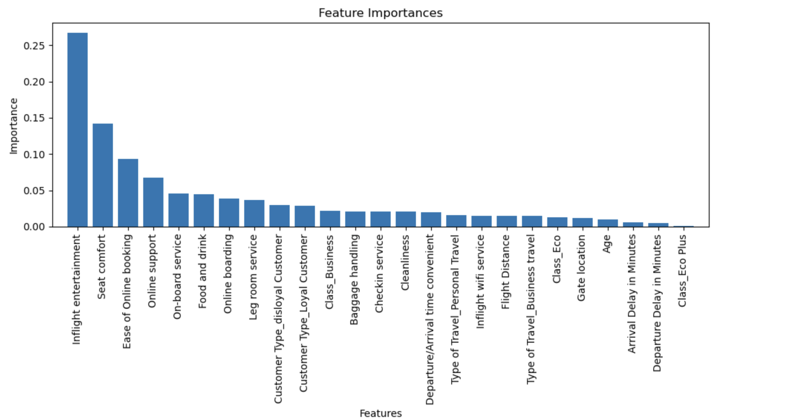

# Random Forest Analysis on Airline Customer Satisfaction

## Project Overview

In this project, I aim to predict customer satisfaction for an airline using a random forest model based on survey feedback. This analysis seeks to identify key drivers of satisfaction, helping the airline make data-informed improvements to customer experience. The dataset includes 129,880 responses, covering aspects such as flight class, flight distance, and in-flight entertainment. This project is a continuation of the project I began modeling with decision trees for an airline.

This project involves predictive modeling with random forests, data exploration, and comprehensive evaluation of model performance.

## Table of Contents
1. [Introduction](#introduction)
2. [Step 1: Imports](#step-1-imports)
3. [Step 2: Data Exploration, Cleaning, and Preparation](#step-2-data-exploration-cleaning-and-preparation)
4. [Step 3: Model Building](#step-3-model-building)
5. [Step 4: Results and Evaluation](#step-4-results-and-evaluation)
6. [Conclusion](#conclusion)
7. [How to Run](#how-to-run)
8. [References](#references)

## Introduction

The goal of this analysis is to uncover factors that influence customer satisfaction using a random forest model. By understanding these drivers, the airline can make targeted service improvements, prioritizing factors that strongly impact satisfaction. This project builds upon previous work with decision trees, enhancing the modeling process and improving predictions.

## Step 1: Imports

### Importing Packages
To begin, we import several key Python libraries and modules:

- **numpy** for numerical operations
- **pandas** for data manipulation
- **matplotlib.pyplot** for visualizations
- **pickle** for saving the model
- **sklearn** for data splitting and model building, including:
  - `RandomForestClassifier` from the `ensemble` module
  - `train_test_split`, `PredefinedSplit`, and `GridSearchCV` from the `model_selection` module
  - Various metrics for evaluation from the `metrics` module, such as `f1_score`, `precision_score`, `recall_score`, `accuracy_score`, `confusion_matrix`, and `ConfusionMatrixDisplay`

## Step 2: Data Exploration, Cleaning, and Preparation

### Loading the Dataset
The dataset is loaded from a spreadsheet containing survey responses from 129,880 customers. 

### Displaying the First Rows
Displaying the first 10 rows of the dataset to get a sense of the data structure and features included.

### Checking for Missing Values
There are **`393` rows in air_data that contain at least one missing value.** As these rows represented a small fraction of the total data, they were removed to maintain data quality.

### Data Cleaning
After dropping the rows with missing values, I save the resulting pandas DataFrame in a variable named `air_data_subset`.

### Encoding Categorical Variables
To ensure the random forest model can interpret the data correctly, categorical variables are converted into indicator (one-hot encoded) features. This step is crucial because the `RandomForestClassifier()` requires categorical features to be numeric.

### Checking the Variable Names and Data Types
Displaying the variable names and their corresponding data types to confirm the conversion of categorical variables to dummy variables.

## Step 3: Model Building

### Separating Labels from Features
The first step in building the model is separating the labels (y) from the features (X).

### Splitting the Data
Splitting the data into training, validation, and test sets to ensure that the model can be evaluated effectively.

### Tuning the Model
Fitting and tuning a random forest model using a separate validation set. Starting by defining a set of hyperparameters to optimize the model with `GridSearchCV`.

### Fitting the Model
Instantiating the model and using `GridSearchCV` to search over the specified parameters, fitting the model to the training data.

### Obtaining Optimal Parameters
After fitting the model, I retrieve the optimal parameters identified by the grid search.

## Step 4: Results and Evaluation

### Predicting on the Test Data
Using the selected model with the optimal parameters, I predict on the test data.

### Model Performance and Metrics
The model's performance was evaluated using several key metrics:

- **Accuracy:** The random forest model achieved an accuracy of **`94.3%`**, indicating that the model correctly predicted customer satisfaction in `94.3%` of cases. This high accuracy suggests the model is well-suited for operational use.

- **Precision:** The precision score was **`95.1%`**, meaning that of all the customers predicted to be satisfied, `95.1%` were actually satisfied. This high precision minimizes false positives, ensuring that fewer instances are wrongly predicted as satisfied, which is crucial for targeting marketing efforts on genuinely satisfied customers.

- **Recall:** The recall score was **`94.5%`**, indicating that of all the actual satisfied customers, `94.5%` were correctly identified by the model. A high recall rate means the model is effective at identifying satisfied customers and minimizes false negatives, helping the airline recognize positive experiences that could enhance customer loyalty.

- **F1 Score:** The F1 score was **`94.7%`**, representing a balance between precision and recall. This score indicates the model’s effectiveness in recognizing actual satisfied customers while minimizing false predictions, making it robust for operational decisions.

The metrics collectively suggest that the model is robust and effective for operational use in predicting customer satisfaction.

### Confusion Matrix
The confusion matrix provides further insight into model performance:

- **True Positives (TP):** `16,747` customers correctly predicted as satisfied.
- **False Positives (FP):** `859` customers incorrectly predicted as satisfied but were actually unsatisfied.
- **True Negatives (TN):** `13,783` customers correctly predicted as unsatisfied.
- **False Negatives (FN):** `983` customers incorrectly predicted as unsatisfied but were actually satisfied.


### Key Features Identified
The top three features that had the highest importance scores were:

1. In-flight Entertainment
2. Seat Comfort
3. Ease of Online Booking



These features had the strongest influence on customer satisfaction, highlighting areas where the airline can focus its improvement efforts.

## Conclusion

**Key Insights**
- **High Model Accuracy:** The random forest model achieved `94.3%` `accuracy` and `94.8%` `f1-score` , showing strong predictive power in identifying customer satisfaction.
- **Influential Features:** `In-flight Entertainment`, `Seat Comfort`, and `Ease of Online Booking` are the top drivers of satisfaction based on feature importance analysis.
- **Model Comparison:** The tuned random forest model demonstrated higher overall scores than the decision tree, particularly with a superior F1 score, indicating better classification performance while accounting for false positives and false negatives.
- **Enhanced Model Performance:** The tuned random forest model outperformed the decision tree across various metrics:

   | Model                  | F1 Score | Recall     | Precision  | Accuracy   |
   |-----------------------|----------|------------|------------|------------|
   | Tuned Decision Tree    | 0.945422 | 0.935863   | 0.955197   | 0.940864   |
   | Tuned Random Forest    | 0.947872 | 0.944557   | 0.951210   | 0.943099   |

**Interpretation of Findings**
- **Satisfaction Prediction:** The model’s high accuracy and balanced performance metrics suggest it is effective for operational use in predicting customer satisfaction.
- **In-flight Entertainment’s Impact:** A high score in `In-flight Entertainment` strongly predicts customer satisfaction, emphasizing its importance for customers and validating potential service investments in this area.

**Summary for Stakeholders**
1. **In-flight Entertainment Focus:** Customers with higher satisfaction ratings tended to score in-flight entertainment highly. Prioritizing enhancements in this area could yield a direct increase in customer satisfaction, as the data suggests a strong correlation.
  
2. **Seat Comfort and Online Booking Ease:** These features also significantly impact satisfaction. Ensuring comfortable seating and an easy booking process can enhance customer perception, especially for high-frequency or long-distance travelers who prioritize comfort and convenience.

3. **Strategic Model Use:** With its high accuracy, this model could be incorporated into customer relationship management (CRM) systems to proactively target customers likely to be unsatisfied and gather feedback or offer incentives to improve their experience. 

4. **Enhanced Model Performance:** The tuned random forest model may provide better classification performance than the decision tree, making it a preferred choice for predicting customer satisfaction.
## How to Run


## How to Run

1. **Clone the repository**:

    ```bash
    git clone <https://github.com/MahmoudKhaled98/Random-Forest-Analysis-on-Airline-Customer-Satisfaction.git>
    ```

2. **Install the required dependencies**:

    ```bash
    pip install -r requirements.txt
    ```

3. **Run the Jupyter notebook**:

    ```bash
    jupyter notebook
    ```
    
## References

- [NumPy Documentation](https://numpy.org/doc/stable/)
- [Pandas Documentation](https://pandas.pydata.org/)
- [Scikit-learn Documentation](https://scikit-learn.org/stable/)
  - [train_test_split](https://scikit-learn.org/stable/modules/generated/sklearn.model_selection.train_test_split.html)
  - [GridSearchCV](https://scikit-learn.org/stable/modules/generated/sklearn.model_selection.GridSearchCV.html)
  - [RandomForestClassifier](https://scikit-learn.org/1.5/modules/generated/sklearn.ensemble.RandomForestClassifier.html)
  - [metrics module](https://scikit-learn.org/stable/modules/classes.html#module-sklearn.metrics)
- [Matplotlib Documentation](https://matplotlib.org/stable/contents.html)

